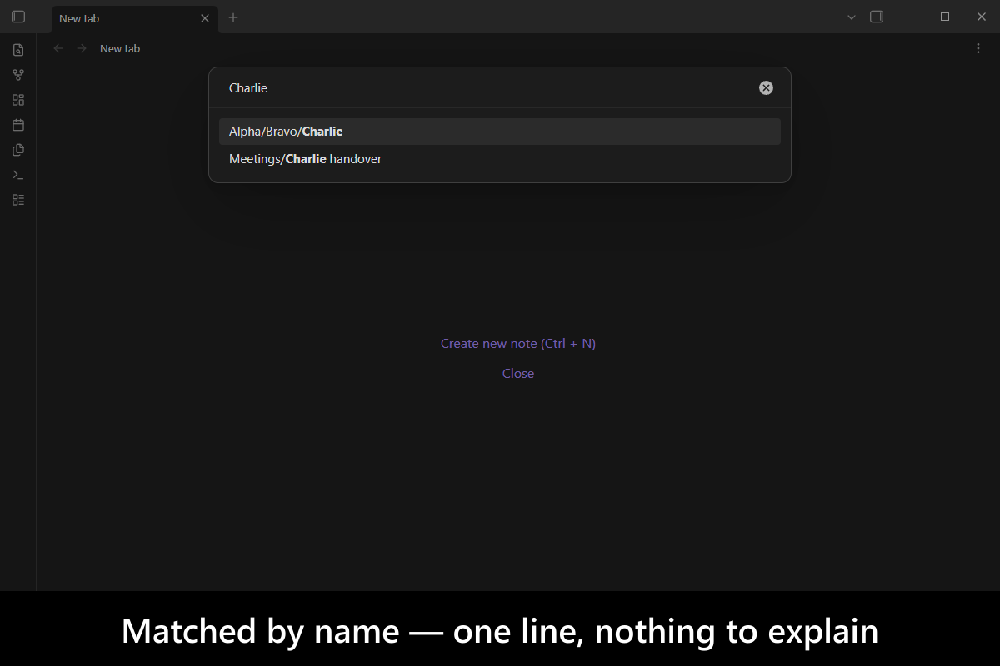
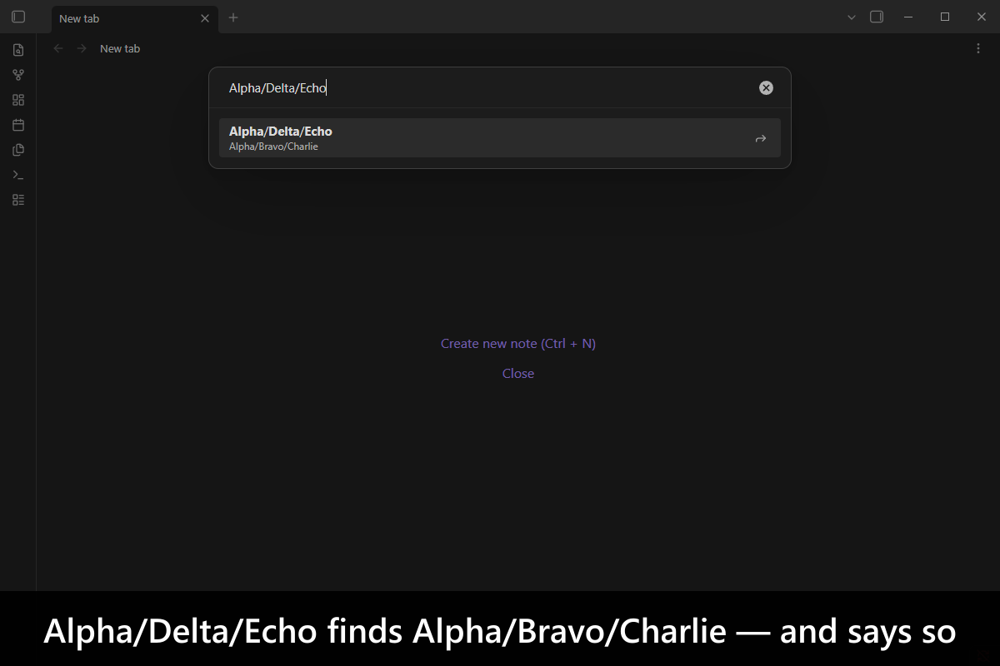
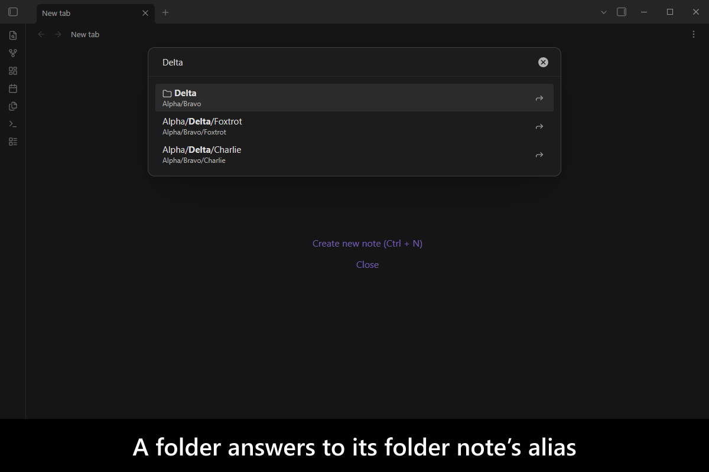
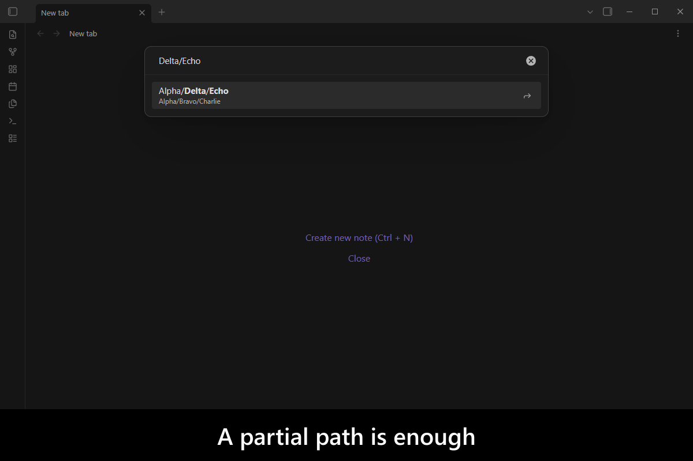
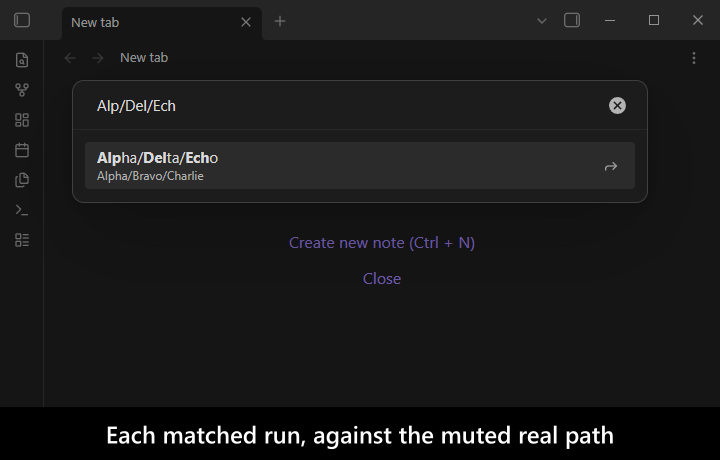
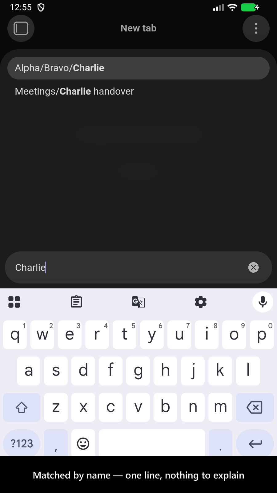
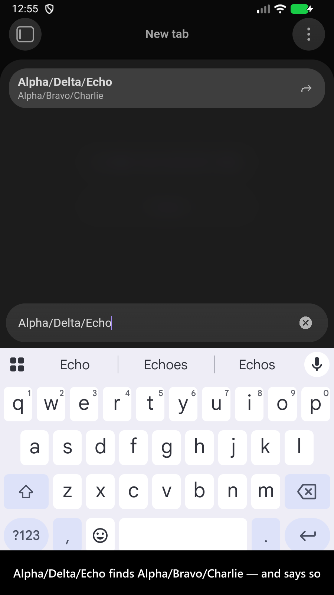
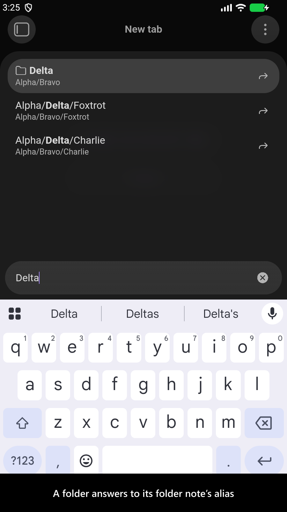
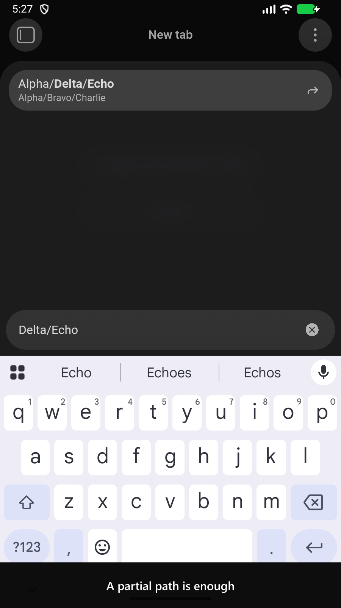

# Alias Quick Switcher

[](https://www.buymeacoffee.com/mnaoumov) [](https://github.com/mnaoumov/obsidian-alias-quick-switcher/releases) [](https://github.com/mnaoumov/obsidian-alias-quick-switcher/releases)

You gave a note an alias so you could find it by the name you actually call it, and you gave its folder one too. Obsidian's quick switcher honours neither the moment you type a path: `Echo` finds the note, but `Alpha/Delta/Echo` finds nothing, because the built-in matches your query against the path **or** against an alias and never against a mixture of the two. This plugin matches segment by segment, where each segment may be satisfied by a real name **or** by an alias — the note's own, or the alias on a folder's folder note.

<!-- markdownlint-disable MD033 -->

<a href="https://github.com/mnaoumov/obsidian-alias-quick-switcher/blob/HEAD/images/screenshots/screenshot-desktop-1.png"></a>

<details>
<summary>More screenshots</summary>

<div>
<a href="https://github.com/mnaoumov/obsidian-alias-quick-switcher/blob/HEAD/images/screenshots/screenshot-desktop-2.png"></a>
<a href="https://github.com/mnaoumov/obsidian-alias-quick-switcher/blob/HEAD/images/screenshots/screenshot-desktop-3.png"></a>
<a href="https://github.com/mnaoumov/obsidian-alias-quick-switcher/blob/HEAD/images/screenshots/screenshot-desktop-4.png"></a>
<a href="https://github.com/mnaoumov/obsidian-alias-quick-switcher/blob/HEAD/images/screenshots/screenshot-desktop-5.png"></a>
<a href="https://github.com/mnaoumov/obsidian-alias-quick-switcher/blob/HEAD/images/screenshots/screenshot-mobile-1.png"></a>
<a href="https://github.com/mnaoumov/obsidian-alias-quick-switcher/blob/HEAD/images/screenshots/screenshot-mobile-2.png"></a>
<a href="https://github.com/mnaoumov/obsidian-alias-quick-switcher/blob/HEAD/images/screenshots/screenshot-mobile-3.png"></a>
<a href="https://github.com/mnaoumov/obsidian-alias-quick-switcher/blob/HEAD/images/screenshots/screenshot-mobile-4.png"></a>
</div>

</details>

<!-- markdownlint-enable MD033 -->

## Demo vault

**The documentation is a demo vault.** Every feature has a note that explains what it does, with a worked example you can search yourself.

**[Start reading here](<./demo-vault/00 Start.md>)** — it is plain markdown, so it works on GitHub with nothing installed.

A copy of the vault ships with every release. You can access it via any of the following:

1. Running the **Alias Quick Switcher: Open demo vault** command.
2. Downloading `alias-quick-switcher-demo-vault.zip` from the [Releases](https://github.com/mnaoumov/obsidian-alias-quick-switcher/releases). It unzips into a single `alias-quick-switcher-demo-vault-<version>` folder.
3. Browsing its source in [`demo-vault/`](./demo-vault/README.md) in this repository.

## What makes it different

Take `Alpha/Bravo/Charlie.md`, where `Charlie` is aliased `Echo` and the `Bravo` folder's folder note is aliased `Delta`. Obsidian's own switcher finds it from the first four queries and from none of the last three:

| Query | Built-in | This plugin |
| --- | --- | --- |
| `Alpha/Bravo/Charlie` | ✅ | ✅ |
| `Alpha Bravo Charlie` | ✅ | ✅ |
| `Bravo Charlie` | ✅ | ✅ |
| `Echo` | ✅ | ✅ |
| `Alpha/Bravo/Echo` | ❌ | ✅ |
| `Alpha/Delta/Charlie` | ❌ | ✅ |
| `Alpha/Delta/Echo` | ❌ | ✅ |

**Folder aliases are the half nothing else does.** A folder has no frontmatter, so its alias lives on its folder note — and no switcher consults it. That matters most in the vaults where it is most needed: if your folder notes all share one name, the built-in cannot reach any of them by name at all, and their aliases are the only handle you have.

**It reads your existing folder-note setup rather than inventing another one.** If the [Folder notes](https://github.com/LostPaul/obsidian-folder-notes) plugin is installed, its live configuration decides which note belongs to a folder — including a custom name and whether the note sits inside the folder or beside it. Nothing is copied into this plugin's settings, so reconfiguring that plugin needs no migration here.

**Every row tells you why it matched, in the switcher's own visual language.** A hit reached through a folder alias is rendered as what you typed — `Alpha/Delta/Echo` — with the real path, `Alpha/Bravo/Charlie`, underneath it and the same alias marker Obsidian already puts on an alias hit. A row matched by real names alone shows one line, because there is nothing to explain. And a plain alias on the note itself looks exactly as it does in the built-in switcher, because it is the same row — this plugin extends that shape to the rest of the path rather than inventing a second one to learn.

**Real names outrank aliases.** A result matched entirely by real names ranks above one that needed an alias, so the plugin never reorders the matches you already get today. That is the default ranking; the other one treats an alias as just another name and orders purely by how well the query matched, which surfaces alias hits sooner and gives that guarantee up. Both are a setting, as is whether a segment has to match as one unbroken run or only as characters in order.

## Usage

Assign a hotkey to **Alias Quick Switcher: Open quick switcher** and type a path. Obsidian's own quick switcher and its `Ctrl+O` are left exactly as they are — this plugin patches nothing, so you decide which of the two your muscle memory opens.

Segments are separated by `/` or by spaces, and a partial path works: `Delta/Echo` is enough.

## Installation

### Beta versions

To install the latest beta release of this plugin (regardless if it is available in [the official Community Plugins repository](https://community.obsidian.md) or not), follow these steps:

1. Ensure you have the [BRAT plugin](https://community.obsidian.md/plugins/obsidian42-brat) installed and enabled.
2. Click [Install via BRAT](https://intradeus.github.io/http-protocol-redirector?r=obsidian://brat?plugin=https://github.com/mnaoumov/obsidian-alias-quick-switcher).
3. An Obsidian pop-up window should appear. In the window, click the `Add plugin` button once and wait a few seconds for the plugin to install.

## Debugging

By default, debug messages for this plugin are hidden.

To show them, run the following command:

```js
window.DEBUG.enable('alias-quick-switcher');
```

For more details, refer to the [documentation](https://mnaoumov.dev/obsidian-dev-utils/guides/debugging/).

## Changelog

All notable changes to this project will be documented in the [CHANGELOG](./CHANGELOG.md).

## Contributing

Contributions are welcome — see [CONTRIBUTING](./CONTRIBUTING.md) to get set up.

## Support

<!-- markdownlint-disable MD033 -->

<a href="https://www.buymeacoffee.com/mnaoumov" target="_blank"></a>

<!-- markdownlint-enable MD033 -->

## My other Obsidian resources

[See my other Obsidian resources](https://github.com/mnaoumov/obsidian-resources).

## License

© [Michael Naumov](https://github.com/mnaoumov/)
